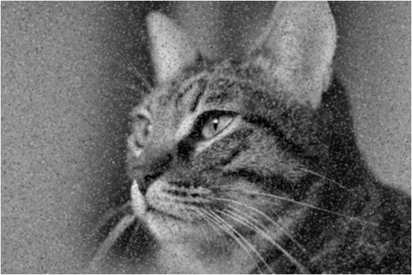

# Computer Architecture I - Image Denoising in RISC-V

Course project developed for **Computer Architecture I** at the **University of Évora**.

## Overview
This project implements a set of **RISC-V Assembly** routines to perform noise removal (denoising) on grayscale images. The program handles low-level file operations and applies a filtering algorithm to process and save the resulting image.

## Repository Structure
- [**/src**](./src) - RISC-V Assembly source code.
- [**/docs**](./docs) - Original assignment brief and technical report (in Portuguese).
- [**/assets**](./assets) - Input and output images used for testing.

## Project Details
- **Dual-Filter Image Processing:** Applies two denoising strategies to the same grayscale input: average filtering and median filtering, enabling direct comparison of smoothing behavior.
- **3×3 Spatial Neighborhood Processing:** Iterates through the full 599×400 matrix (239,600 pixels) and computes each interior pixel from its local 3×3 neighborhood.
- **Border Handling Strategy:** Detects edge pixels (first/last row and column) and sets them to white (`255`) instead of filtering, avoiding boundary artifacts while preserving image size.
- **Custom Arithmetic Routines:** Includes manual multiplication (`multi`) and division (`divi`) routines in Assembly. The project uses these routines in filter calculations, while also documenting that native `mul`/`div` instructions would execute faster.
- **End-to-End File Workflow:** Performs low-level file operations in Assembly: reads `cat_noisy.gray` into memory, processes two passes (average and median), and writes two output files with preserved dimensions and grayscale format.

## Technical Context
- **ISA and Execution Model:** RISC-V 32-bit Assembly (RARS), with explicit register preservation and stack-frame management across `matriz`, `media`, `mediana`, `multi`, and `divi`.
- **System Calls and File Handling:** Uses RARS `ecall` services for complete file lifecycle management: open (`1024`), read (`63`), write (`64`), close (`57`), print (`4`), and exit (`10`).
- **Memory Organization:** Allocates fixed buffers in `.data` for input and output images (`239600` bytes each) plus a temporary 9-byte neighborhood array for median calculation.
- **Addressing Strategy:** Implements row-major 2D-to-1D pixel addressing over a 599×400 grayscale matrix and applies signed relative offsets to access 3×3 neighborhoods.
- **Core Concepts Practiced:** Low-level file I/O, pointer arithmetic, branch-based control flow, neighborhood-based image filtering, and algorithmic trade-offs between clarity and runtime efficiency.

## Important Notes
- The original assignment and detailed technical report (in Portuguese) are available in the `/docs` folder.
- Names were removed and redacted from documents to maintain privacy and confidentiality.
- Documentation wording and repository-structure organization were refined with AI assistants (GitHub Copilot and Google Gemini). All AI-generated outputs were critically reviewed and validated to ensure technical accuracy and content integrity.

## Visual Results

| Before (Noisy) | After (Average Filter) | After (Median Filter) |
| :---: | :---: | :---: |
|  |  |  |

---
[⬅️ **Back to My Learning Journey**](https://github.com/BroteusSKTP/BroteusSKTP/blob/main/LearningLabs.md)
